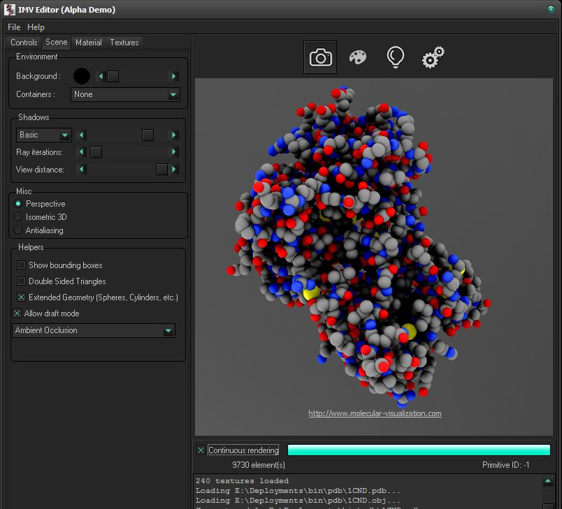
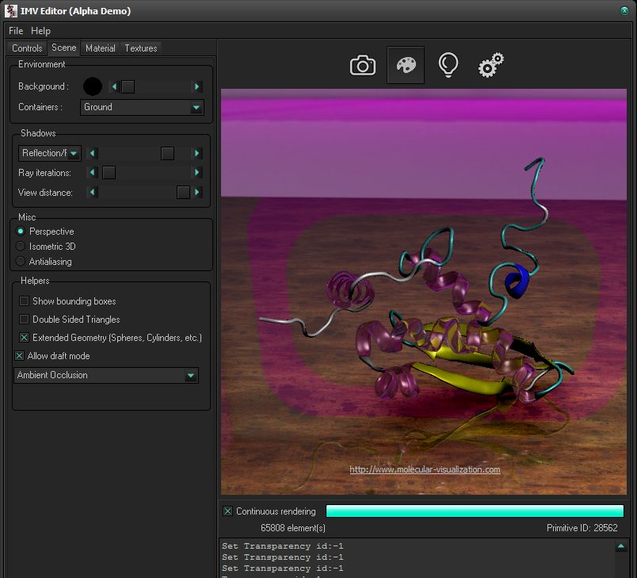

### Introduction
Sol-R-UI is a Delphi-based User Interface for the Sol-R ray-tracer (https://github.com/cyrillefavreau/Sol-R).

A number of videos can be found on my channel: https://www.youtube.com/user/CyrilleOnDrums

May the fun continue with your contributions! :-)

### Screenshots

### Supported platforms

Sol-R-UI has currently been tested on:
- Windows 7
